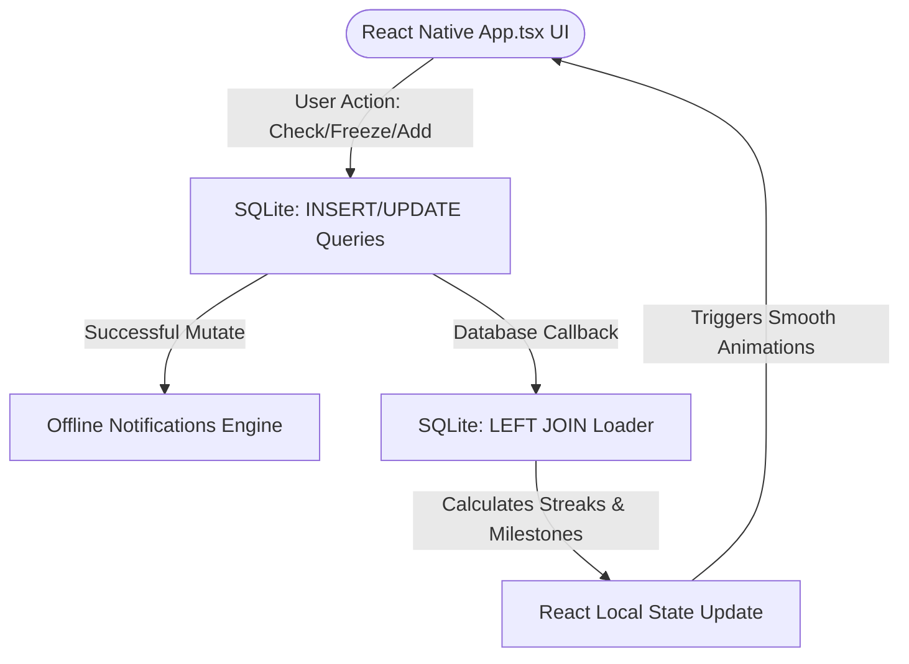

# Metanoia 🎓

> **Metanoia** *(noun)*: The journey of changing one's mind, heart, self, or way of life.

Metanoia is a premium, distraction-free, local-first offline task tracking and routine automation application built with **Expo SDK 57**, **TypeScript**, and **SQLite (`expo-sqlite`)**. It is designed using **NativeWind (Tailwind CSS)** and fully verified by a **Jest unit test suite**.

Instead of being a perpetual crutch, Metanoia's core philosophy is **Identity Integration**—helping you build daily discipline, track long-term milestones, and eventually **graduate** routines off your checklist once they become permanent parts of who you are.

---

## 🚀 Key Features

*   🔄 **Unidirectional Local-First Data Flow**: Mutates SQLite tables directly and reacts instantly with fast local state updates. Works 100% offline.
*   ❄️ **Streak Freeze Exceptions**: A one-tap toggle next to the header that marks today as a "free pass" (focus, school, work, or recovery day). Bypasses tasks and preserves your streak neutrally without resetting it.
*   🧘 **60-Second Mindful Transition**: Tapping any incomplete task card opens a fullscreen breathing transition with a timer and pulsing concentric rings to overcome procrastination.
*   📝 **Daily Reflection Logger**: Triggers automatically when you check off the final task of the day. Collects focus ratings (Yes/No), energy levels (Low/Medium/High), and your biggest win.
*   🏆 **Identity Milestone Checkpoints**: Hitting a streak of exactly **7**, **30**, **100**, or **365** days unlocks a comparative checkpoint sheet to document how your mindset and habits have transformed.
*   🎓 **Habit Graduation & The Hall of Identity**: Once a habit is automated (reaches 100 or 365 days), you can graduate it. This archives it from your active daily list and places it in your profile's **Hall of Identity** as a badge of honor.
*   📊 **28-Day Consistency Grid**: A visual, wrapped GitHub-style contribution grid of your last 28 days (completed, failed, frozen, or rest days) to track consistency trends.
*   🔔 **Offline Focus Reminders**: Automatically schedules weekly push notifications (`expo-notifications`) locally when your blueprint is modified, prompting you to switch tasks without needing internet access.

---

## 🏗️ System Architecture

Metanoia uses a **unidirectional state synchronization architecture** that guarantees that the SQLite database serves as the absolute source of truth.



### 🗄️ Database Schema Specification
The local database consists of five tables managed via `src/db/database.ts`:

1.  **`master_schedule`**: Stores your weekly routine blueprints (Mon-Sun).
    ```sql
    CREATE TABLE IF NOT EXISTS master_schedule (
        id INTEGER PRIMARY KEY AUTOINCREMENT,
        day_of_week TEXT NOT NULL,         -- 'Mon', 'Tue', 'Wed', 'Thu', 'Fri', 'Sat', 'Sun'
        time_start TEXT NOT NULL,          -- 'HH:MM' (24-hour format)
        activity_name TEXT NOT NULL,
        category TEXT NOT NULL,            -- 'fitness', 'code', 'rest', 'mindset'
        estimated_duration INT DEFAULT 60,
        is_graduated INTEGER DEFAULT 0,    -- 0 = Active, 1 = Graduated/Automated
        graduation_date TEXT               -- 'YYYY-MM-DD' when habit was automated
    );
    ```
2.  **`progress_logs`**: Tracks daily checklist completions.
    ```sql
    CREATE TABLE IF NOT EXISTS progress_logs (
        id INTEGER PRIMARY KEY AUTOINCREMENT,
        schedule_id INTEGER NOT NULL,
        log_date TEXT NOT NULL,            -- 'YYYY-MM-DD'
        is_completed INTEGER DEFAULT 0,    -- 0 = Incomplete, 1 = Complete
        FOREIGN KEY(schedule_id) REFERENCES master_schedule(id) ON DELETE CASCADE
    );
    CREATE UNIQUE INDEX IF NOT EXISTS idx_logs_date_schedule ON progress_logs (log_date, schedule_id);
    ```
3.  **`day_exceptions`**: Logs streak freeze dates.
    ```sql
    CREATE TABLE IF NOT EXISTS day_exceptions (
        log_date TEXT PRIMARY KEY,         -- 'YYYY-MM-DD'
        exception_type TEXT NOT NULL DEFAULT 'freeze'
    );
    ```
4.  **`daily_reflections`**: Stores end-of-day reviews.
    ```sql
    CREATE TABLE IF NOT EXISTS daily_reflections (
        log_date TEXT PRIMARY KEY,         -- 'YYYY-MM-DD'
        focus_rating INTEGER,              -- 0 = Distracted, 1 = Focused
        energy_level TEXT,                 -- 'low', 'medium', 'high'
        win_text TEXT                      -- Win description
    );
    ```
5.  **`milestone_reflections`**: Captures long-term identity checkpoints.
    ```sql
    CREATE TABLE IF NOT EXISTS milestone_reflections (
        id INTEGER PRIMARY KEY AUTOINCREMENT,
        milestone_day INTEGER NOT NULL,    -- 7, 30, 100, 365
        log_date TEXT NOT NULL,            -- 'YYYY-MM-DD'
        feelings_text TEXT,                -- 'How I feel now'
        changes_text TEXT                  -- 'Changes since Day 1'
    );
    ```

---

## 📂 Project Directory Structure

```text
Metanoia/
├── App.tsx                     # Main application UI, navigation & hooks
├── app.json                    # Expo configurations & plugins (SQLite, Notifications)
├── eas.json                    # EAS build and OTA update profiles
├── global.css                  # Tailwind styles and NativeWind directives
├── jest.config.js              # Jest test environments configuration
├── metro.config.js             # NativeWind compiler integration for Metro
├── postcss.config.mjs          # PostCSS processor settings
├── tsconfig.json               # TypeScript compiler options
└── src/
    ├── db/
    │   └── database.ts         # SQLite schema initialization & routine weekly seeding
    └── utils/
        ├── time.ts             # Pure functions for Mon-Sun dates & streak logic
        └── __tests__/
            └── time.test.ts    # Jest unit test assertions (13 cases)
```

---

## 🛠️ Development & Commands

### 1. Setup & Installation
Clone the repository and install all node modules:
```bash
npm install
```

### 2. Run the App (Expo Go)
Start the local Expo development server:
```bash
npx expo start
```
Scan the generated QR code in your terminal using your phone camera (iOS) or the Expo Go App (Android).

### 3. Run Jest Tests
Run the unit test suite to verify date calculations, active indicators, and streak freeze conditions:
```bash
npm run test
```

### 4. Check Types
Validate type-safety across the application:
```bash
npx tsc --noEmit
```

### 5. Build Native Standalone Binary (EAS Build)
To trigger an EAS cloud build for android or iOS:
```bash
eas build --platform android --profile preview
```
